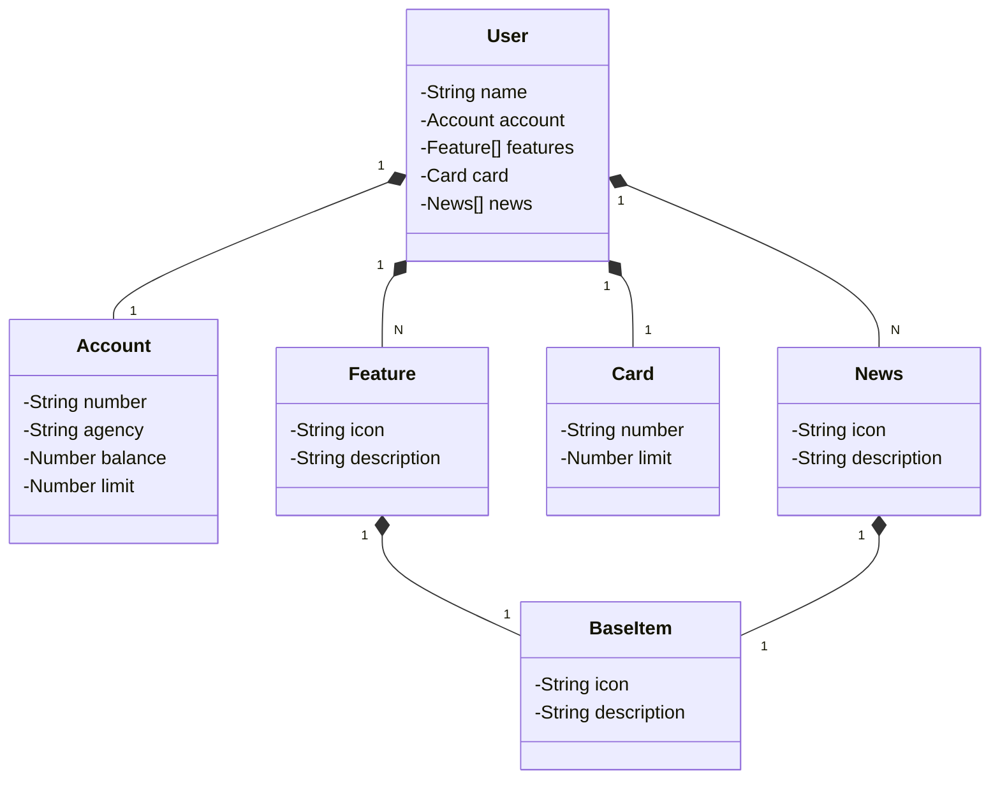

# Bank API

## Introduction

Welcome to the Bank API project. This API is implemented in Java using Spring Boot and Gradle and is designed to simulate basic banking functionalities. It includes functionalities for managing users, accounts, features, cards, and news within a banking system. This README will provide an overview of the project's structure, including the schema and endpoints available.

## Authors

- Gabriel Cesar Silvino Xavier

## Schema

### Class Diagram

## Endpoints

### Retrieve a User

- **GET /users/{id}**

  Retrieves a user by their ID.

### Create a User

- **POST /users**

  Creates a new user.
